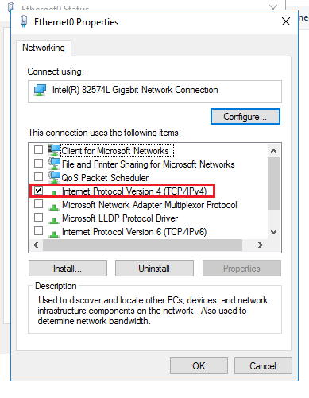
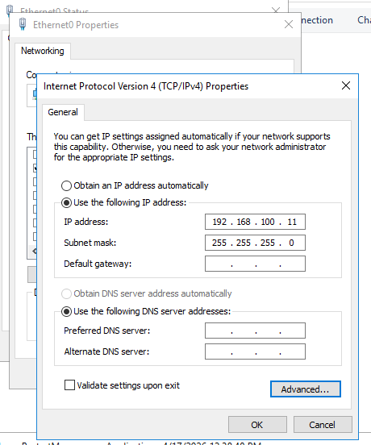

## What I Did

### 1. Prepare the Vault Server Environment
I started with a fresh Windows Server installation and performed these critical pre-install tasks to ensure security and compatibility:

- Installed .NET Framework Runtime and Visual C++ Redistributable 2022, then **restarted the server**.
- Configured the Network Interface Card (NIC):
  - Opened **Network Connections** > Properties of the active adapter.
  - Removed **Client for Microsoft Networks**, **File and Printer Sharing**, and any unnecessary protocols.
  - Kept only **Internet Protocol Version 4 (TCP/IPv4)**.
- Set DNS servers to blank (no entries) to prevent DNS-based attacks.
- Disabled WINS:
  - In Advanced TCP/IP Settings > WINS tab:
    - Unchecked **Enable LMHOSTS lookup**.
    - Selected **Disable NetBIOS over TCP/IP**.
- Verified static IP, no domain membership, and synchronized server time with an NTP source.
- Created a dedicated installation folder (e.g., `D:\CyberArkInstall`) and copied the entire installation package there **before any hardening**.

*Screenshot description: Network adapter properties showing only TCP/IPv4 enabled and unnecessary components uninstalled.*

|  Unselect all other protocols   | IPv Configuration | 
|------|--------|
|   |   | 

---

### 2. Launch the Vault Installation Wizard
I navigated to the `Server` folder in the installation package and right-clicked `Setup.exe` > **Run as administrator**.

- The wizard started and automatically checked for prerequisites (it would error if .NET or VC++ were missing).
- If running over RDP, confirmed the session message and clicked **Yes**.
- Accepted the license agreement.
- Entered my name and organization details.

*Screenshot description: Initial CyberArk Digital Vault Setup window with Install button highlighted.*

---

### 3. Select Installation Mode and Paths
- Chose **Standalone Vault Installation** (not Cluster-node, which requires a separate license).
- Selected destination folder for Vault files (default `C:\Program Files (x86)\PrivateArk` is recommended; only change drive letter if needed).
- Chose Safes location (default `C:\PrivateArk\Vault\Safes` or similar). This is the secure data store for all passwords, files, and objects. Considered future growth (PSM recordings can consume terabytes).
- Provided the path to the license file (`.xml`).

*Screenshot description: Vault Installation Mode screen with Standalone option selected.*

---

### 4. Configure Keys and Remote Access
- Specified the Operator CD path (pointed to the copied Operator folder or CD drive). This contains the Server Key and Recovery Public Key — required to start the Vault service.
- Configured the Remote Control Agent (RCA):
  - Entered the IP address of my management workstation.
  - Set a strong password for remote access.
  - (Recommended: Use only CyberArk component servers for remote access; can enable later if skipped.)

**Security Tip**: Store keys securely after install — never leave them on the server long-term.

---

### 5. Harden the Server and Complete Installation
- Proceeded to **Vault Server Machine Hardening**. This applies CyberArk-recommended hardening based on Microsoft Security Compliance Manager (disables unnecessary services). I left the checkbox unchecked to proceed with hardening.
- Selected the program folder name (default is fine).
- The installer ran, showed progress, and applied hardening.
- Set strong passwords for built-in users:
  - **Master** (emergency break-glass account).
  - **Administrator** (daily admin use).
  - Password rules: 6–39 characters, mix of upper/lower/numeric, no special forbidden characters like `% \ " & ^ > < |`.
- On the **Setup Complete** screen, chose **No, I will restart my computer later**.
- Clicked **Finish**.

*Screenshot description: Built-in Users Passwords screen with Master and Administrator fields.*

**Post-Install Actions**:
- Restarted the server.
- Verified services in `services.msc`:
  - PrivateArk Database
  - PrivateArk Server
  - CyberArk Logic Container
  - Cyber-Ark Event Notification Engine
  - PrivateArk Remote Control Agent (if enabled)
- Opened **PrivateArk Server Management Console** from the Start menu and confirmed the firewall message: "ITAFW001I Firewall is open for client communication."

---

### 6. Install the PrivateArk Client and Initial Verification
- Ran the Client installer from the package (separate `Client` folder).
- Verified I could connect to the Vault using the PrivateArk Client or PVWA (after further component installs).
- Checked logs in `Server\Logs\VaultConfiguration.log` for any warnings.

The Vault was now operational as the secure core of my PAM environment!

---

## Key Takeaways

- **Layered Security Built-In**: The install automatically enables session encryption (TCP 1858), hardened Windows Firewall, role-based access, mandatory controls, auditing, and per-object encryption.
- **Keys Are Critical**: Operator and Master CDs must be accessible at startup and stored securely afterward.
- **Hardening Is Irreversible**: Once applied, services are locked down — reinstall the OS to undo.
- **Standalone First**: Perfect for learning; scale to Primary-DR or cluster later with additional licenses.
- **Beginner Wins**: Following the wizard exactly + pre-checks ensures a successful, production-ready Vault without common pitfalls like DNS exposure or missing prerequisites.

This setup gives you a fully functional self-hosted CyberArk PAM Vault ready for adding components like PVWA, CPM, and PSM. Test access with the built-in Administrator user and explore the PrivateArk Client for Safe creation and user management next!
