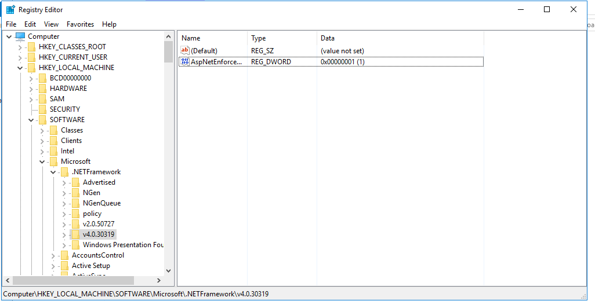
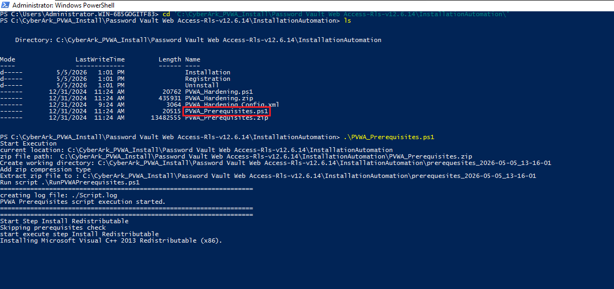
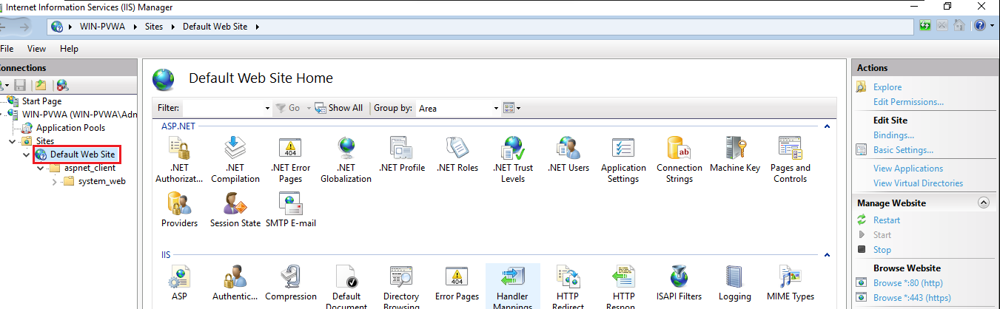
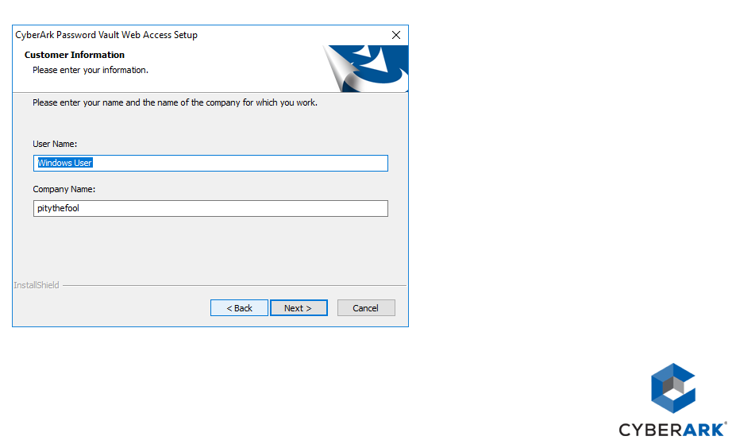
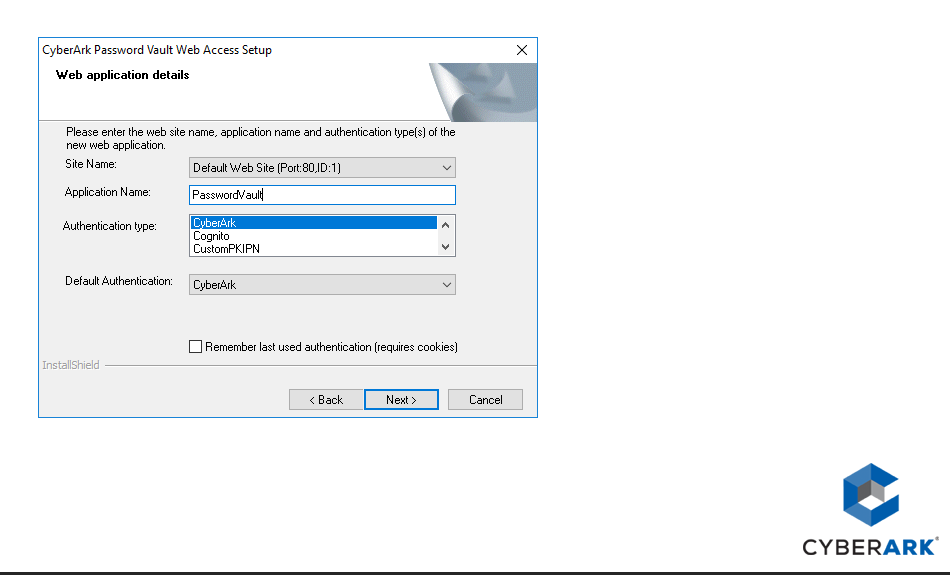
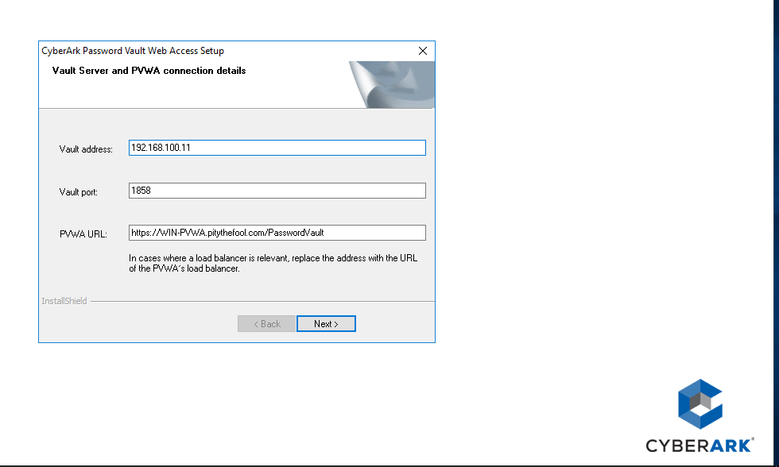
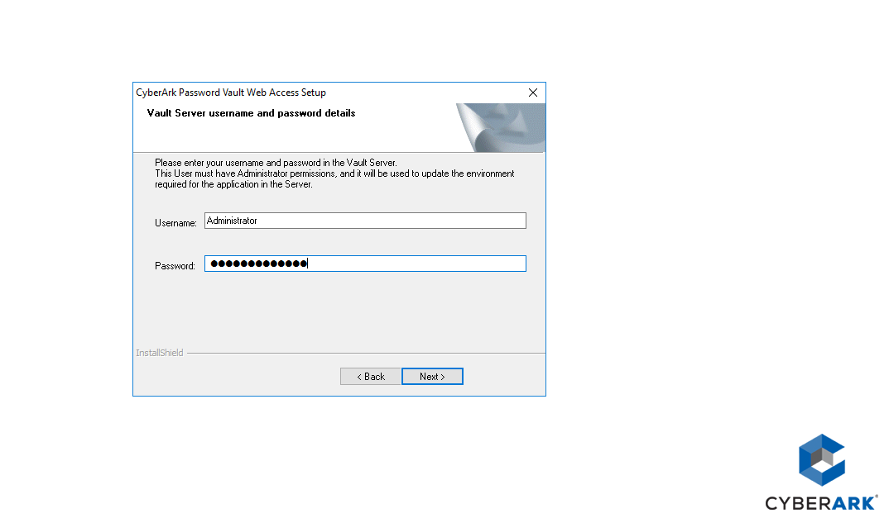

## What I Did (Step-by-Step)

### 1. Understanding What PVWA Actually Is

Before touching a single setting, I made sure I understood what I was building. The **PVWA (Password Vault Web Access)** is the browser-based front-end for CyberArk PAM. Think of it as the "dashboard" that your IT admins and end users log into when they need to:

- Request access to privileged accounts (like a server's local admin password)
- Launch secure, monitored remote sessions
- View and manage accounts stored in the Vault

Without PVWA, the only way to interact with the Vault would be through the PrivateArk desktop client — which is much more limited. PVWA is what makes CyberArk usable at scale.

---

### 2. Preparing the Windows Server

I started with a clean Windows Server 2019 virtual machine. A few things had to be in place before anything else:

- The server needed to be joined to the domain (or at least reachable on the network)
- I had to be logged in as a **local Administrator** — not a domain admin account. This is a common gotcha: the domain admin account alone will not work for the CyberArk installation
- I confirmed that **.NET Framework 4.8** was installed by checking the Windows Registry under:
  `HKEY_LOCAL_MACHINE > SOFTWARE > Microsoft > .NET Framework > v4\Full`
  
  If the `SKU` value shows **528040** or higher, you're good to go.

    <div>
    
  </div>

---

### 3. Running the Prerequisites Script (Pre-Installation)

CyberArk provides a PowerShell script that automatically sets up everything the server needs before PVWA can be installed. This script does a lot of heavy lifting so you don't have to manually configure each thing.

**What the script does automatically:**
- Installs and configures the **IIS Web Server role**
- Configures **HTTPS binding** on the web server
- Disables **IPv6** (required by CyberArk)
- Creates a **self-signed SSL certificate** so the browser can communicate securely with PVWA
- Applies **TLS settings** for secure communication
- Validates the .NET Framework version

**How I ran it:**

1. Copied the `PVWA` folder from the CyberArk installation package to the server
2. Navigated to the `PVWA\InstallationAutomation` folder
3. Opened **PowerShell as Administrator**
4. Typed `pvwa_pre` and pressed **Tab** to autocomplete the script name, then ran it:

```powershell
.\PVWA_Prerequisites.ps1
```

5. Waited for the script to finish and reviewed the output for any errors
6. After it completed, I opened **IIS Manager** (search "IIS" in Start Menu) and confirmed that **IIS version 10** was installed and showing — this confirms the web server is ready
7. **Rebooted the server** before proceeding

  <div>
   
  </div>

  | Selected the View Configuraton | Exported the Configuration from DC01 | 
  |------|--------|
  |    | 


> 💡 **Tip:** Always reboot after the prerequisites script. Skipping this step can cause unexpected issues during the actual installation.

---

### 4. Installing PVWA (The Main Installation)

With the server prepped and rebooted, I was ready to run the main PVWA installer.

1. Navigated to the `Password Vault Web Access` folder inside the installation package
2. **Right-clicked** `Setup.exe` and selected **"Run as Administrator"**

   > ⚠️ Do not just double-click it — it must be explicitly run as Administrator, or it will fail

3. Accepted the License Agreement and clicked **Next**
4. Entered my name and company name in the **Customer Information** window
5. Left the **destination folder** as the default (easiest path for a first install) and clicked **Next**
6. In the **Web Application Details** window, I configured:
   - **Site Name:** `Default Web Site`
   - **Application Name:** `PasswordVault`
   - **Authentication Types:** Selected **CyberArk, LDAP, and Windows** — this keeps things simple and covers the most common login methods. Other methods like RADIUS or PKI can be added later
   - **Default Authentication:** Set to `CyberArk`
   
7. In the **Vault Connection Details** window, I entered:
   - The **IP address** of the CyberArk Vault server
   - The **port number** (default is **1858**)
   - The **PVWA URL** — for example: `https://pvwa.yourdomain.com/PasswordVault`
   
   > 💡 **This step is critical.** The PVWA URL must be accurate because it's written into the PVWA's configuration file and controls how the Vault communicates back. A typo here causes connection failures later.

8. Entered the **Vault Administrator username and password** to allow the installer to create the necessary Safes and user accounts inside the Vault
9. Clicked through the remaining screens and let the installation complete
10. Clicked **Finish**
11. **Restarted the server**

  | Entered my company's name | Web Application Details | 
  |------|--------|
  |    | 
  | <p align="center"> **Vault Connection details** </p> | <p align="center"> **Vault Server username and password details** </p> |
  |    | 


---

### 5. Verifying the Installation

After rebooting, I ran a quick sanity check:

1. Opened **IIS Manager** and confirmed the `PasswordVault` application was listed under `Default Web Site`
2. Opened **Google Chrome** on the PVWA server and navigated to:
   `https://localhost/PasswordVault`
   
   The CyberArk PVWA login page appeared — this confirmed the web application was running correctly.

3. Logged in with the Vault Administrator credentials to verify the connection to the Vault was working end-to-end

> 💡 **Use Chrome or Edge for testing, not Internet Explorer.** CyberArk 12.6 works best with modern browsers.

---

### 6. Running the Hardening Script (Post-Installation)

The installation itself leaves the server in a functional but not fully secured state. CyberArk provides a **hardening script** that locks down the server to reduce the attack surface.

1. Opened **PowerShell as Administrator**
2. Navigated to `PVWA\InstallationAutomation`
3. Ran the hardening script:

```powershell
.\PVWA_Hardening.ps1
```

**What the hardening script does:**
- Restricts file system permissions
- Disables unnecessary Windows features and services
- Creates a **PVWAReportsUser** account that runs the CyberArk Scheduled Tasks service

**One important manual step after hardening:**

The `PVWAReportsUser` account that gets created needs its password set to never expire (or you'll have scheduled tasks breaking silently in the future):

1. Open **Computer Management** → **Local Users and Groups** → **Users**
2. Right-click `PVWAReportsUser` → **Properties**
3. Check **"Password never expires"**
4. Click **OK**

> 💡 **Note:** If you plan to install PSM (Privileged Session Manager) on the same server, set the `IsPSMInstalled` parameter to `True` inside the `PVWA_Hardening_Config.xml` file *before* running the hardening script. Running the hardening script without this flag on a shared server can break the PSM installation.

---

### 7. Post-Installation Check: Reviewing the Log Files

CyberArk creates several log files during installation that are useful for troubleshooting:

| Log File | Location | What It Contains |
|---|---|---|
| Main installation log | Default Windows Temp folder | Full install process output |
| `CheckConnection.log` | PVWA config folder `Env\Log` | Vault connection status |

If something went wrong during the wizard-based install, `CheckConnection.log` is the first place to look — it tells you exactly whether PVWA successfully connected to the Vault.

---

### 8. Optional: Replacing the Self-Signed Certificate

The prerequisites script created a self-signed SSL certificate, which causes browsers to show a security warning. For a lab environment this is fine, but in production you would replace this with a **trusted SSL certificate** from your organization's Certificate Authority (CA):

1. Obtain a certificate from your CA signed for the PVWA's FQDN
2. Import it into IIS via **Server Certificates** in IIS Manager
3. Update the HTTPS binding on `Default Web Site` to use the new certificate

---

## Key Concepts I Focused On

- **Least Privilege During Installation:** The Vault Admin account was only used during installation. Day-to-day admin work should use dedicated operational accounts, not the master admin.
- **Pre-requisites First, Always:** Skipping or rushing the prerequisites script is the #1 cause of CyberArk installation failures. The script must complete cleanly and the server rebooted before moving on.
- **SSL is Non-Negotiable:** Without a valid SSL certificate (even a self-signed one), the browser will block access to PVWA entirely. Production environments need a CA-trusted cert.
- **Log Files are Your Friend:** CyberArk's installation generates detailed logs. If something fails, the logs tell you exactly what happened and where.

---

## What I Learned

- How to properly prepare a Windows Server for an enterprise security application before touching the installer
- Why CyberArk separates prerequisites, installation, and hardening into three distinct phases — and why cutting corners on any of them causes problems
- **Most importantly:** I learned that CyberArk PAM is not just a password manager — it's a complete privileged access governance framework. The PVWA is the control plane that makes all of that accessible through a browser.

---

## Conclusion: Why This Lab Matters

Setting up PVWA from scratch gave me a deep appreciation for how enterprise PAM solutions actually work under the hood. It's not just clicking "Install" — it's understanding the architecture, the trust relationships between components, and the security reasoning behind each configuration decision.

Through this project, I gained confidence in:

1. **Windows Server Administration:** Navigating IIS, PowerShell, local user management, and registry verification in a real deployment scenario.
2. **Security Hardening:** Understanding that "installed" and "secure" are two different things — and knowing the steps to get from one to the other.
3. **CyberArk Architecture:** Understanding how the PVWA, Vault, and other PAM components communicate and depend on each other to form a cohesive privileged access solution.
4. **Troubleshooting Methodology:** When something didn't work, I learned to check the logs first, verify prerequisites second, and re-read the steps third — a discipline that applies to all infrastructure work.

This lab has prepared me to work with CyberArk in a professional environment and meaningfully contribute to PAM implementation, administration, and troubleshooting.

---

## About

A hands-on cybersecurity lab project documenting the end-to-end installation of CyberArk PAM Self-Hosted 12.6 PVWA (Password Vault Web Access) on Windows Server 2019, including prerequisites, configuration, hardening, and verification.
