## What I Did (Step-by-Step)

### 1. Preparing the PSM Server

I started with a clean **Windows Server 2019** virtual machine named `WIN-PSM`, joined to the `pitythefool.com` domain.

**Key differences from PVWA and CPM preparation:**

Unlike PVWA and CPM which require the **local Administrator** account, PSM installation requires a **domain user account** that is a member of the **local Administrators group**. This is because RDS and PSM's group policy configurations interact with the domain, and a pure local account cannot handle that properly.

Before starting I confirmed:

- Logged in as a **domain user** (`pitythefool\administrator`) who is in the local Administrators group
- The domain user account name does not contain the `^` character — CyberArk's installer explicitly rejects usernames with this character
- **.NET Framework 4.8** was installed and confirmed via the Registry:
  `HKLM:\SOFTWARE\Microsoft\NET Framework Setup\NDP\v4\Full` — Release value **528040** or higher
- Network connectivity confirmed to all required components:

```powershell
# Test Vault connectivity
Test-NetConnection -ComputerName <VaultIP> -Port 1858

# Test PVWA connectivity (PSM connects to PVWA's API Gateway)
Test-NetConnection -ComputerName <PVWAIP> -Port 443
```

Both must return `TcpTestSucceeded : True` before proceeding.

<div>
  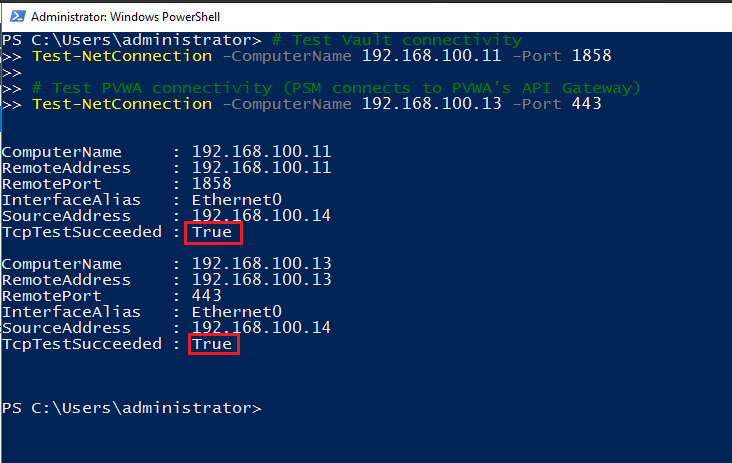
</div>

> 💡 **Important:** PSM must be able to reach **both** the Vault and PVWA. Unlike CPM which primarily connects to the Vault, PSM connects to the PVWA API Gateway to receive session requests and return status information. A firewall blocking port 443 to PVWA will cause PSM to install but fail to receive any connection requests.

---

### 2. Setting Up Remote Desktop Services (RDS)

This is the step that makes PSM fundamentally different from every other CyberArk component. **RDS must be configured before running the PSM installer.**

PSM uses Windows RDS as its session brokering engine. When a user launches a session through PVWA, what actually happens is a RemoteApp session being launched through PSM's RDS infrastructure. Without RDS configured first, the PSM installer will fail or install incorrectly.

**Installing the RDS Session Host role:**

1. Opened **Server Manager** → **Add Roles and Features**
2. On the **Installation Type** page, selected **"Remote Desktop Services installation"** — NOT the standard role-based installation. This is a specific option that installs RDS as a complete service rather than individual components
3. On the **Deployment Type** page, selected **"Standard Deployment"**
4. On the **Deployment Scenario** page, selected **"Session-based desktop deployment"**
5. On the **RD Connection Broker** page — selected `WIN-PSM` as the server
6. On the **RD Web Access** page — selected `WIN-PSM` as the server
7. On the **RD Session Host** page — selected `WIN-PSM` as the server
8. Checked **"Restart the destination server automatically if required"**
9. Clicked **Deploy** and waited for all three RDS roles to install
10. The server rebooted automatically

<div>
  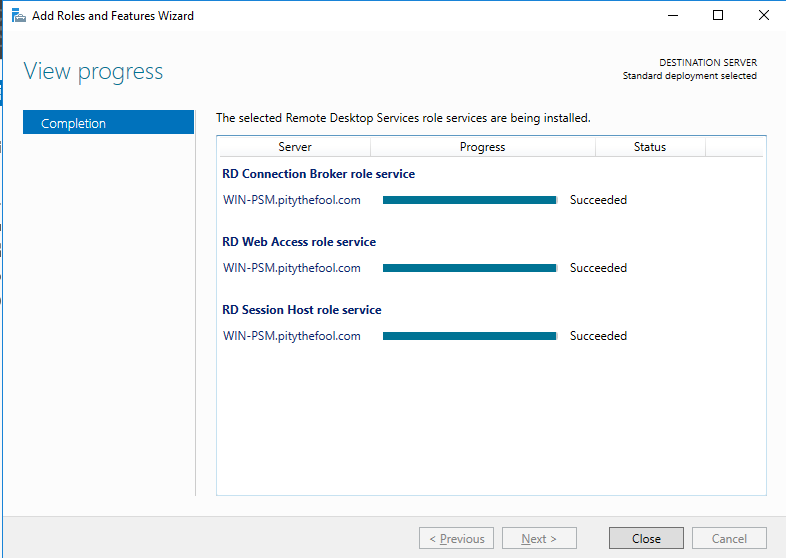
</div>

> ⚠️ **Critical:** Select **"Remote Desktop Services installation"** as the installation type — not "Role-based or feature-based installation." Selecting the wrong type and manually checking individual RDS checkboxes will not configure RDS correctly for PSM, and the session brokering will not work.

**After the reboot — creating the RDS Session Collection:**

1. Opened **Server Manager** → clicked **Remote Desktop Services** in the left panel
2. Clicked **Collections** → **Tasks** → **Create Session Collection**
3. On the **Collection Name** page, entered a name (e.g., `PSM-Collection`)
4. On the **RD Session Host** page, selected `WIN-PSM`
5. On the **User Groups** page, **removed all user groups listed** — PSM manages its own user access and does not use standard RDS user groups
6. Added only the administrator account currently logged in (so I could still connect to test)
7. On the **User Profile Disks** page, **unchecked "Enable user profile disks"**
8. Clicked **Create** and waited for the collection to be created

| 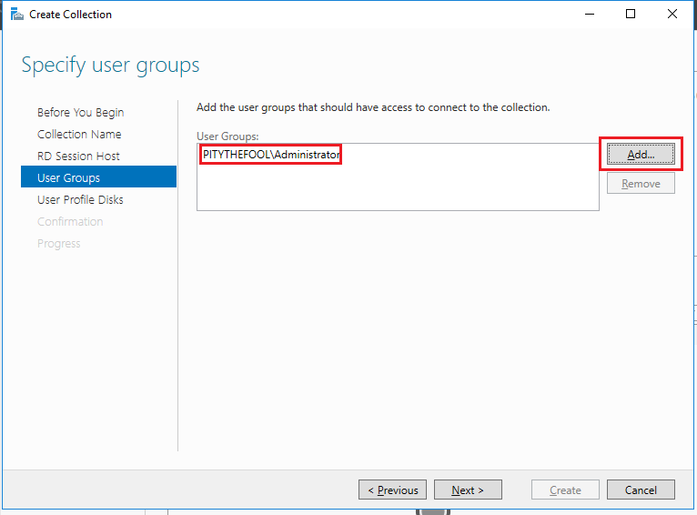 | 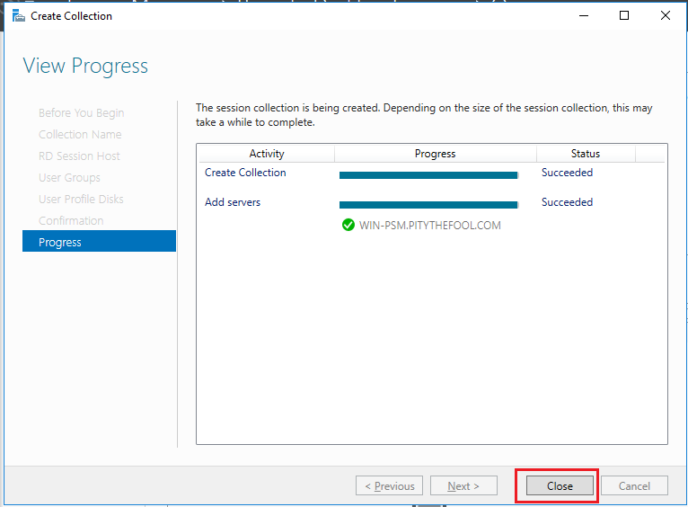 | 
|---|---|
| *Removed Users  and added just the admin account I'm logged in as* | *Created an RDS Session Collection* | 

---

### 3. Running the Prerequisites Script

With RDS configured and the server rebooted, I ran the PSM prerequisites script.

1. Copied the `Privileged Session Manager` folder from the CyberArk installation package to the PSM server
2. Navigated to the `InstallationAutomation` folder
3. Opened **PowerShell as Administrator**
4. Ran the prerequisites script:

```powershell
.\Execute-Stage.ps1 .\Prerequisites\PrerequisitesConfig.XML
```

5. Waited for the script to complete and confirmed no failures in the output
6. **Rebooted the server**

<div>
  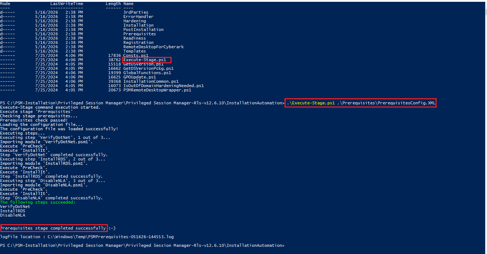
</div>

> 💡 **Note:** The PSM prerequisites script uses a different execution syntax compared to the PVWA and CPM scripts — it uses `Execute-Stage.ps1` with a config XML file as the parameter rather than a single standalone script. This is normal for PSM 12.6.

---

### 4. Installing PSM (The Main Installation)

With the server rebooted and RDS confirmed, I ran the main PSM installer.

1. Navigated to the `Privileged Session Manager` folder from the installation package
2. **Right-clicked** `Setup.exe` → **Run as Administrator**
3. The installer opened and displayed a **list of prerequisites** it will install automatically — clicked **Install** to begin
4. Clicked **Next** to accept the welcome screen
5. Accepted the **License Agreement**
6. Entered name and company in the **Customer Information** window
7. Left the **Destination Location** as the default and clicked **Next**

8. On the **Vault Connection Details** window, entered:
   - **Vault IP address** — IP of the CyberArk Vault server
   - **Port** — `1858`
   - **Username** — Vault Administrator username
   - **Password** — Vault Administrator password

   The installer uses these credentials to create the PSM user accounts and Safes in the Vault automatically.

9. On the **API Gateway Connection Details** window, entered:
   - **Protocol:** `https`
   - **Hostname:** `win-pvwa.pitythefool.com`

   > 💡 **This step is unique to PSM.** Unlike PVWA and CPM, PSM requires the PVWA URL at installation time because PSM connects to the PVWA API Gateway to receive session brokering instructions. The format it uses internally is `https://win-pvwa.pitythefool.com/PasswordVault/api`. If this is entered incorrectly, PSM installs successfully but cannot receive any session requests from PVWA.

10. On the **Authentication Options** page — left PKI and SAML unchecked (not used in this lab environment)
11. On the **Ticketing System** page — left unchecked (no ticketing system integrated)
12. On the **Hardening** window — clicked **Next** to accept the recommended hardening. PSM's hardening runs as part of the installation wizard rather than as a separate post-installation script like PVWA and CPM

13. Clicked **Finish** to complete the installation
14. **Rebooted the server**

| 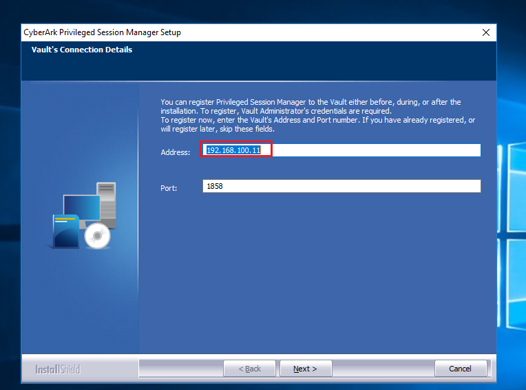 | 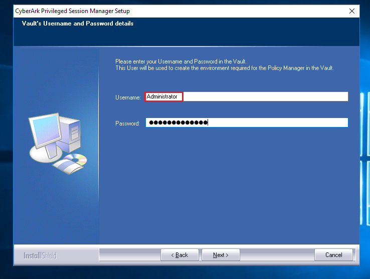 | 
|---|---|
| *Entered the Vault Details to connect* | *Entered the Vault Username and Password (Vault Administrator)* | 
| 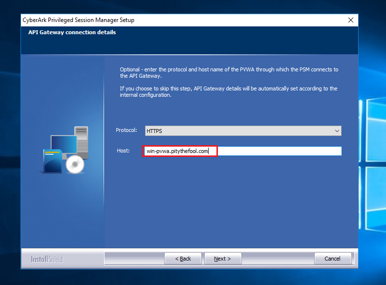 | 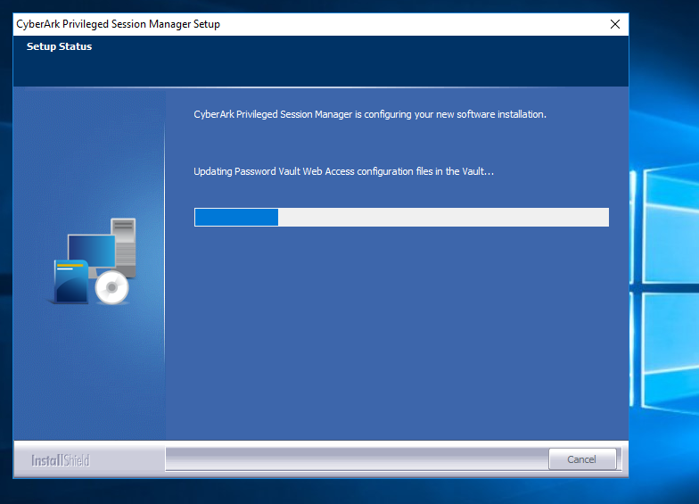 |
| *Entered the PVWA API gateway to connect* | *PSM Installation Progress* |


---

### 5. What Gets Created During Installation

During installation, CyberArk automatically creates several users, groups, and Safes in the Vault. Understanding these is important for troubleshooting later:

**Users created on the PSM server (local Windows accounts):**
| Account | Purpose |
|---|---|
| `PSMConnect` | The account used to initiate privileged sessions on behalf of users |
| `PSMAdminConnect` | An elevated version of PSMConnect for administrative sessions |

**Groups created on the PSM server:**
| Group | Purpose |
|---|---|
| `PSMShadowUsers` | Members of this group can shadow (monitor live) active PSM sessions |

**Safes created in the Vault:**
| Safe | Contents |
|---|---|
| `PSM` | Stores the PSM server's credential files and user accounts |
| Recording Safes | Created automatically when the first session recording is uploaded to the Vault |


| 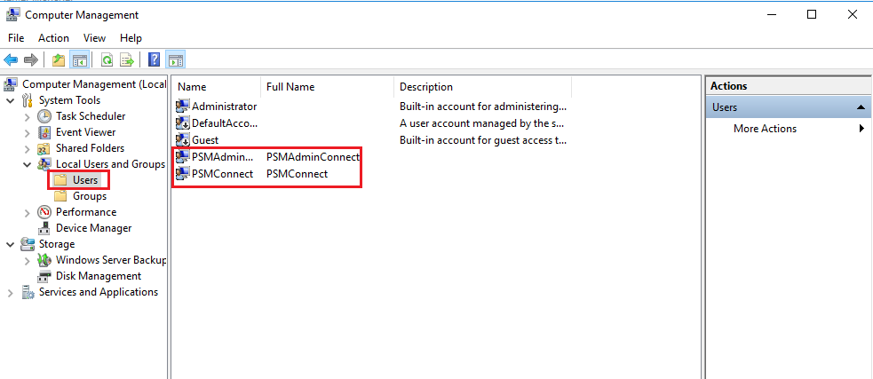 | 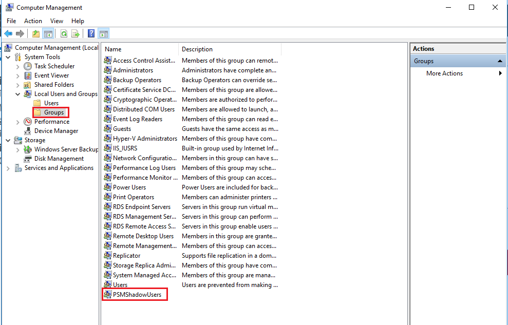 | 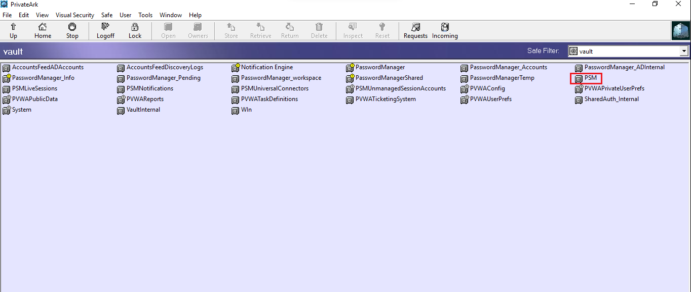  |
|---|---|---|
| *Users account created in the Local Windows Account* | *Group Created on the PSM serve* | *PSM safe created in the Vault* |

> 💡 **Why this matters:** If the PSM service fails to start after installation, the first thing to check is whether these accounts and Safes were created in the Vault. If they weren't, the Vault connection failed silently during installation, and the registration step needs to be rerun.

---

### 6. Running iisreset on the PVWA Server

This is an easy-to-miss but important step — after PSM installs and registers itself, the PVWA server needs to be refreshed to pick up the new PSM configuration.

On the **PVWA server** (`WIN-PVWA`), opened PowerShell as Administrator and ran:

```powershell
iisreset
```

This forces IIS to reload the PVWA application and its configuration, which now includes the registered PSM server. Without this, PVWA may not route session requests to the PSM correctly until IIS naturally recycles on its own.

---

### 7. Verifying the PSM Service is Running

After rebooting the PSM server, I confirmed the Windows service started correctly.

1. Opened **Services** (`services.msc`)
2. Located **CyberArk Privileged Session Manager**
3. Confirmed **Status: Running** and **Startup Type: Automatic**

If the service is stopped, right-click → **Start**. If it stops again immediately, check the PSM log:

```powershell
Get-Content "C:\Program Files (x86)\CyberArk\PSM\Logs\PSMTrace.log" -Tail 50
```

This log records exactly what the PSM service attempted on startup and where it failed.

<div>
  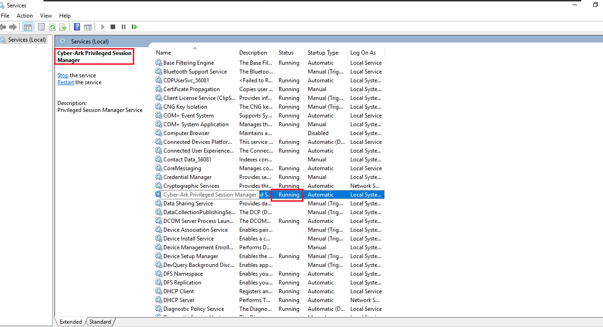 
</div>

---

### 8.Verified PSM in PVWA

After confirming the service was running, I logged into PVWA to activate and verify the PSM.

**Checking System Health:**

1. Opened Chrome and navigated to `https://win-pvwa.pitythefool.com/PasswordVault`
2. Logged in with Vault Administrator credentials
3. Went to **Administration** → **System Health**
4. Located the **PSM** section on the dashboard
5. The PSM server should appear — confirmed it showed as **Connected** with a green status indicator

<div>
  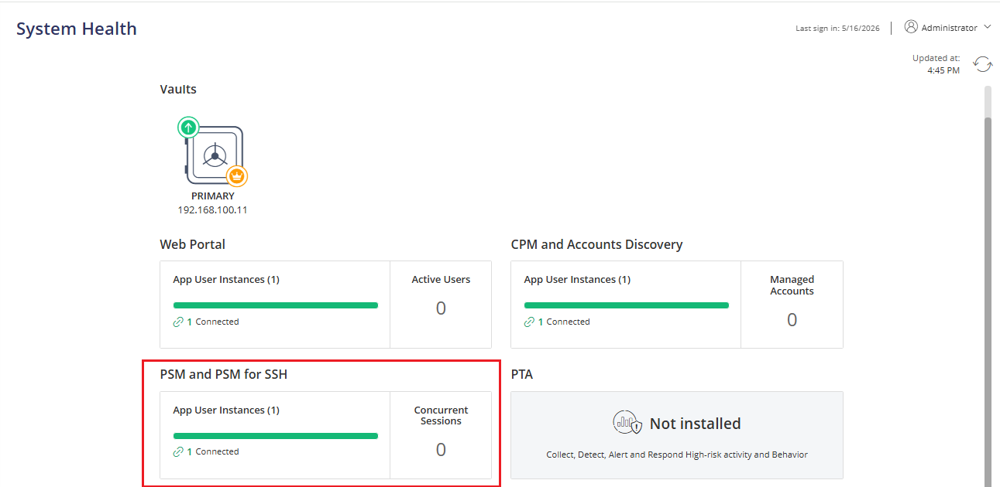 
</div>
---

### 9. Post-Hardening: Important Considerations

PSM's hardening is significantly more aggressive than PVWA or CPM hardening. A few important things to be aware of after hardening runs:

**File system navigation is blocked for administrators:**
After hardening, administrators cannot freely browse the PSM server's file system through Windows Explorer. This is intentional — PSM is designed to operate as a locked-down appliance. To restore file system access for administrative tasks, update this registry key:

```
HKEY_CURRENT_USER\Software\Microsoft\Windows\CurrentVersion\Policies\Explorer
"NoRun" = dword:00000000
```

**AppLocker is enabled:**
PSM hardening activates **AppLocker**, which whitelists only approved applications. Any application not explicitly approved will be blocked from running on the PSM server. This is why PSM servers should never have additional software installed — every extra application needs to be AppLocker-approved.

**TLS 1.0 and 1.1 are disabled:**
All communication to and from the PSM server requires **TLS 1.2**. Target systems that only support older TLS versions will not be reachable through PSM without additional configuration.

---

### 10. Checking the PSM Log Files

PSM generates two primary log files that are useful for troubleshooting:

| Log File | Location | What It Contains |
|---|---|---|
| `PSMTrace.log` | `C:\Program Files (x86)\CyberArk\PSM\Logs\` | Detailed service activity and errors |
| `PSMConsole.log` | `C:\Program Files (x86)\CyberArk\PSM\Logs\` | High-level session events and status messages |

New log files are created automatically when the existing files reach their maximum size, with timestamps added to the old filename. Old logs are moved to a `\Logs\old` subfolder and deleted after the number of days configured in PSM settings.

---

## Key Concepts I Focused On

- **PSM as a Jump Server:** PSM doesn't just store or rotate passwords — it physically sits between the user and the target system, acting as the only allowed connection path. This is what makes privileged session isolation possible at the network level.
- **RDS is the Foundation:** PSM's entire session brokering capability is built on Windows Remote Desktop Services. The RDS configuration is not optional or cosmetic — without it, PSM cannot function at all.
- **Hardening is Included:** Unlike PVWA and CPM where hardening is a separate post-installation script, PSM runs hardening as part of the wizard. This makes it easier to ensure hardening is never accidentally skipped.
- **PVWA Activation is Required:** A newly installed PSM is not automatically active. The manual activation step in PVWA is what switches PSM from "registered" to "operational."
- **iisreset on PVWA:** After PSM registers, the PVWA server must be restarted (via iisreset) to pick up the configuration. This is a step unique to PSM installation and is easy to forget.

---

## What I Learned

- Why PSM requires a fundamentally different server setup (RDS Session Host) compared to every other CyberArk component — and how that relates to its core function as a session proxy
- The difference between PSM being "installed," "registered," and "activated" — three distinct states that must all be achieved before PSM is operational
- How PSM's aggressive hardening (AppLocker, file system restrictions, TLS enforcement) reflects the sensitivity of what it handles — live privileged sessions and their recordings
- **Most importantly:** I learned that PSM is where the real-world value of CyberArk becomes visible to end users. Everything else — the Vault, PVWA, CPM — operates mostly behind the scenes. PSM is the component that a security analyst, auditor, or incident responder actually *uses* to watch, record, and review what privileged users are doing on critical systems.

---

## Conclusion: Why This Lab Matters

With PSM installed and active, my CyberArk PAM lab environment is now a complete, functional Privileged Access Management solution:

| Component | Role | Status |
|---|---|---|
| Vault | Secure credential and recording storage | ✅ Installed |
| PVWA | Web-based management and access portal | ✅ Installed |
| CPM | Automated password rotation and verification | ✅ Installed |
| **PSM** | **Session isolation, monitoring, and recording** | ✅ **Installed** |

Through this project, I gained confidence in:

1. **Remote Desktop Services Administration:** Configuring RDS Session Host, creating session collections, and understanding how RDS underpins PSM's session brokering capabilities.
2. **Session Security Architecture:** Understanding how isolating sessions through a jump server prevents credential exposure and lateral movement — and why this is one of the most important controls in a privileged access program.
3. **CyberArk End-to-End Architecture:** Having now installed all four core PAM components, I understand how each one depends on the others and why the installation order (Vault → PVWA → CPM → PSM) matters.
4. **Hardening Trade-offs:** Understanding that PSM's aggressive hardening makes it more secure but also more restrictive to administer — and knowing how to navigate those restrictions when legitimate administrative access is needed.

This lab, combined with the PVWA and CPM installations, has given me a complete, working understanding of CyberArk PAM Self-Hosted from the ground up.

---

## About

A hands-on cybersecurity lab project documenting the end-to-end installation of CyberArk PAM Self-Hosted 12.6 PSM (Privileged Session Manager) on a dedicated Windows Server 2019, including Remote Desktop Services configuration, Vault and PVWA integration, hardening, activation, and session verification.
