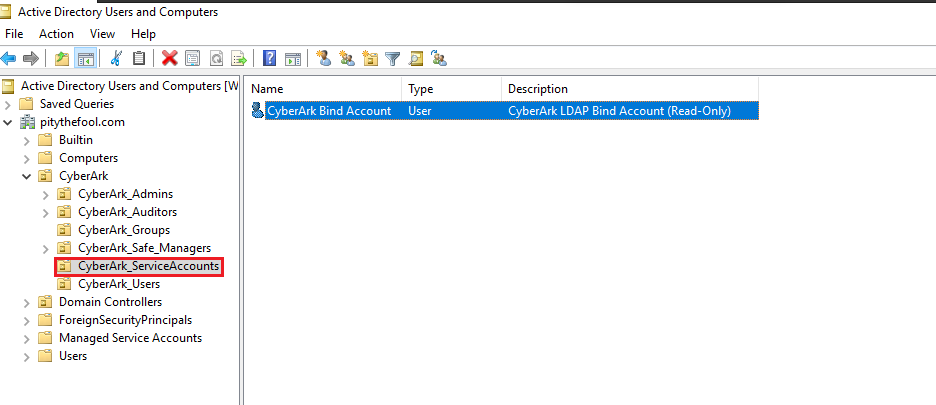
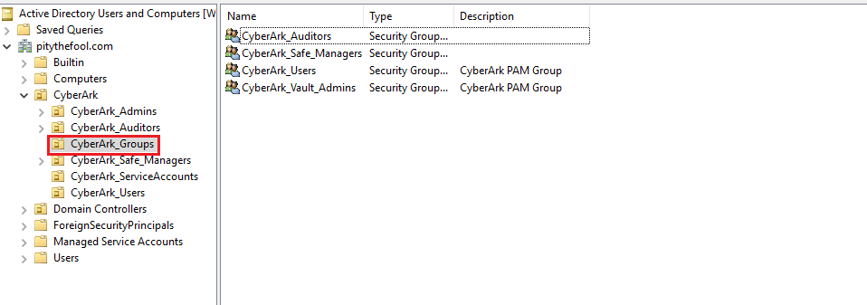

## What I Did (Step-by-Step)

### 1. Creating the Required Active Directory Objects

Before touching PVWA, I had to create the necessary objects in Active Directory first. Everything is done on the **Domain Controller** using **Active Directory Users and Computers (ADUC)**.

**Step 1a: Created the LDAP Bind Account**

This is the service account CyberArk will use to connect to and query AD.

1. Opened **Active Directory Users and Computers** on the Domain Controller
2. Navigated to the **Users** container (or a dedicated Service Accounts OU if you have one)
3. Right-clicked → **New** → **User**
4. Filled in the details:
   - **First name:** `CyberArk`
   - **Last name:** `Bind Account`
   - **User logon name:** `cyberarkbindaccount`
5. Clicked **Next** and set a strong password
6. Checked **"Password never expires"** — critical, as explained above
7. Left **"User must change password at next logon"** unchecked
8. Clicked **Next** → **Finish**

> 💡 **Tip:** Keep the bind account credentials documented securely. If this password ever changes and is not updated in CyberArk's LDAP configuration, all LDAP logins will fail immediately.

**Step 1b: Created the Four CyberArk AD Security Groups**

These four groups are what CyberArk will map its role levels against. Each group corresponds to a different level of access in CyberArk.

In **ADUC**, right-clicked the **Users** container → **New** → **Group** for each of the following:

| Group Name | Group Scope | Group Type | CyberArk Role |
|---|---|---|---|
| `CyberArk Vault Admins` | Global | Security | Full administrative access to the Vault |
| `CyberArk Safe Managers` | Global | Security | Create and manage Safes and accounts |
| `CyberArk Auditors` | Global | Security | Read-only access to audit logs and sessions |
| `CyberArk Users` | Global | Security | Standard end-user access to request accounts |

After creating all four groups, I added the relevant domain user accounts to each group based on their intended role. For testing purposes, I added my administrator account to **CyberArk Vault Admins**.

|  |  | 
|---|---|
| *Created `CyberArk bind account` for integration*  | *Gour groups created in AD* | 
> 💡 **Why four groups?** CyberArk's role model maps directly to these four levels. You don't need to create them all at once — start with Vault Admins and Users. But having all four from the beginning means your LDAP mapping is future-proof as your team grows.

---

### 2. Navigated to LDAP Integration in PVWA

1. Opened Chrome and logged into PVWA at `https://win-pvwa.pitythefool.com/PasswordVault` using the internal **Administrator** account
2. Clicked **User Provisioning** in the left navigation panel
3. Clicked **LDAP Integration**
4. The LDAP Integration page opened — currently empty since no domain had been configured yet
5. Clicked **New Domain** to begin the configuration wizard

---

### 3. Step 1 of the Wizard: Defined the Domain

This is where I told CyberArk the basic details of the Active Directory domain it will connect to.

Fields I filled in:

| Field | Value | Why |
|---|---|---|
| **Domain Name** | `pitythefool.com` | The FQDN of the AD domain |
| **Domain NetBIOS Name** | `PITYTHEFOOL` | The short-form domain name used in `DOMAIN\Username` format |
| **Bind Account Username** | `cyberarkbindaccount` | The dedicated service account created in Step 1a |
| **Bind Account Password** | `<password set in AD>` | CyberArk uses this to authenticate to AD for queries |
| **Bind Account Domain** | `pitythefool.com` | The domain the bind account belongs to |

> ⚠️ **The Bind Account username format matters.** Enter it as just the username (`cyberarkbindaccount`), not in `DOMAIN\username` or UPN (`cyberarkbindaccount@pitythefool.com`) format unless the wizard specifically asks for it. Using the wrong format is a common cause of connection failures at the next step.

Clicked **Next** to proceed.

---

### 4. Step 2 of the Wizard: Selected Domain Controllers

On this screen, CyberArk automatically detected the available Domain Controllers in the `pitythefool.com` domain.

1. The wizard displayed a list of detected Domain Controllers
2. Selected `WIN-6B5GOGITF83.pitythefool.com` from the list
3. Clicked **Connect**
4. CyberArk used the Bind Account credentials to test the connection — a green success indicator confirmed the connection to AD was working

> 💡 **If the connection test fails here:** The most common causes are a wrong Bind Account password, a firewall blocking LDAP port **389** (or LDAPS port **636** for secure connections) between the PVWA server and the Domain Controller, or the Bind Account being locked out. Check all three before assuming a configuration error.

Clicked **Next** to proceed.

---

### 5. Step 3 of the Wizard: Created Directory Mapping

This is the most important step — where the AD groups created in Step 1b are linked to CyberArk's role levels.

The wizard presented four role slots to map:

**Vault Admins mapping:**
- Clicked **Add** next to Vault Admins
- Browsed the AD directory and selected the `CyberArk Vault Admins` group
- Confirmed the group appeared in the mapping

**Safe Managers mapping:**
- Clicked **Add** next to Safe Managers
- Selected `CyberArk Safe Managers`

**Auditors mapping:**
- Clicked **Add** next to Auditors
- Selected `CyberArk Auditors`

**Users mapping:**
- Clicked **Add** next to Users
- Selected `CyberArk Users`

The completed mapping looked like this:

| CyberArk Role | Mapped AD Group |
|---|---|
| Vault Admins | `CyberArk Vault Admins` |
| Safe Managers | `CyberArk Safe Managers` |
| Auditors | `CyberArk Auditors` |
| Users | `CyberArk Users` |

> 💡 **You can skip group mappings and add them later.** If you don't have all four AD groups ready, you can map what you have and add the remaining mappings after the wizard completes. The domain configuration will still save correctly.

Clicked **Next** to proceed.

---

### 6. Step 4 of the Wizard: Review and Save

The final wizard screen showed a summary of all the configuration:
- Domain name and NetBIOS name
- Bind account username
- Domain Controller selected
- All four group mappings

Reviewed each entry for accuracy and clicked **Save**.

CyberArk stored the LDAP configuration in the `LDAPConf.xml` file inside the `VaultInternal` Safe — this happens automatically in the background. The LDAP domain now appeared on the LDAP Integration page.

> ⚠️ **Never manually edit `LDAPConf.xml` directly.** All LDAP changes must go through the PVWA wizard. Editing the file directly can corrupt the configuration in ways that are difficult to diagnose.

---

### 7. Enabled LDAP as an Authentication Method in PVWA

Configuring the LDAP domain is only half the work. I also needed to confirm that **LDAP** was enabled as a login method in PVWA's authentication settings — otherwise the LDAP login option would not appear on the login screen.

1. In PVWA, went to **Administration** → **Configuration Options**
2. Expanded **Authentication Methods**
3. Located **LDAP** in the list
4. Confirmed it was set to **Enabled: Yes**

If LDAP was showing as disabled, I would have clicked it, changed Enabled to **Yes**, and clicked **Apply**.

> 💡 **This step is easy to overlook.** The LDAP domain can be fully configured but if the authentication method is disabled, users will not see the LDAP login option on the PVWA login screen and will assume the integration is broken.

---

### 8. Testing the LDAP Login

With the domain configured and LDAP authentication enabled, I tested whether a domain user could log in.

1. Opened a new browser tab and navigated to `https://pvwa.pitythefool.com/PasswordVault`
2. On the PVWA login screen, clicked **"Change authentication method"** at the bottom left
3. Selected **LDAP** from the available options
4. Entered the credentials of a domain user who was a member of the `CyberArk Vault Admins` AD group:
   - **Username:** `administrator` (domain administrator account)
   - **Password:** domain password
5. Clicked **Sign In**

The login succeeded and PVWA loaded with the Administrator's full Vault Admin permissions — confirming that:
- The Bind Account successfully authenticated to AD
- CyberArk queried the user's group membership
- The Directory Mapping correctly matched `CyberArk Vault Admins` → Vault Admin role
- A Vault user was automatically provisioned for this AD account

---

### 9. What Happens Behind the Scenes on First LDAP Login

Understanding what CyberArk does automatically on a user's first LDAP login is useful for troubleshooting and administration:

1. CyberArk uses the **Bind Account** to query AD for the logging-in user's details
2. It checks the user's AD group memberships against the **Directory Mapping** rules
3. If a match is found, CyberArk automatically **creates a Vault user** linked to the AD account
4. The Vault user is given the permissions corresponding to their mapped role
5. On subsequent logins, CyberArk re-checks group membership — if the user has been removed from all mapped AD groups, their Vault user is deactivated automatically

This means **user lifecycle is managed entirely through Active Directory** once LDAP integration is in place.

---

## Key Concepts I Focused On

- **Bind Account Security:** The Bind Account only needs read access to AD — it should never be given Domain Admin or any elevated privileges. Least privilege applies to service accounts just as much as to human accounts.
- **Password Never Expires:** Setting the Bind Account password to never expire is not a security shortcut — it is a deliberate operational decision. The alternative is a recurring outage every time the password expires. The account's read-only scope means the risk is minimal and acceptable.
- **Directory Mapping is the Access Control Layer:** The AD groups are not just organisational labels — they are the mechanism that determines what every LDAP user can and cannot do in CyberArk. Managing AD group membership *is* managing CyberArk access.
- **LDAP vs LDAPS:** This lab used standard LDAP (port 389). In a production environment, **LDAPS** (port 636) with a valid SSL certificate should be used to encrypt the authentication traffic between PVWA and the Domain Controller. Sending credentials over unencrypted LDAP is not acceptable in a real environment.
- **Never Edit LDAPConf.xml Directly:** All LDAP configuration must go through the PVWA wizard. The file is managed by CyberArk and direct edits can silently corrupt it.

---

## What I Learned

- How CyberArk's Transparent User Management model works — and why managing CyberArk access through AD group membership is significantly more maintainable than managing internal Vault users manually
- The difference between the Bind Account (which queries AD) and the AD groups (which control access) — these are two distinct concepts that are easy to confuse initially
- Why the LDAP authentication method must be explicitly enabled in PVWA in addition to configuring the domain — two separate settings that must both be correct for the login option to appear
- **Most importantly:** I learned that LDAP integration is where CyberArk transitions from a standalone PAM tool to an integrated enterprise security platform. Once connected to AD, CyberArk inherits the organisation's identity governance — joiners, movers, and leavers are all handled automatically through existing HR and IT processes rather than requiring separate administration in CyberArk.

---

## Conclusion: Why This Lab Matters

LDAP integration is not an optional add-on — it is what makes CyberArk operationally viable in an enterprise environment. Managing individual internal Vault users at scale is not realistic. Connecting CyberArk to Active Directory means the organisation's existing identity management processes automatically govern who has access, at what level, and for how long.

Through this project, I gained confidence in:

1. **Active Directory Administration:** Creating and managing service accounts, security groups, and understanding how directory queries work in an enterprise identity environment.
2. **LDAP Protocol Fundamentals:** Understanding how Bind Accounts work, what Base DNs are, and how LDAP queries traverse directory structures to find users and groups.
3. **CyberArk Role Architecture:** Understanding the four core CyberArk role levels (Vault Admins, Safe Managers, Auditors, Users) and how Directory Mapping bridges them to the organisation's existing group structure.
4. **Enterprise Identity Integration:** Understanding that PAM solutions do not exist in isolation — they must integrate with the organisation's identity infrastructure to be manageable and auditable at scale.

---

## About

A hands-on cybersecurity lab project documenting the end-to-end configuration of LDAP integration between CyberArk PAM Self-Hosted 12.6 and Active Directory, including Bind Account creation, AD group setup, directory mapping, authentication method configuration, and end-to-end login verification.
