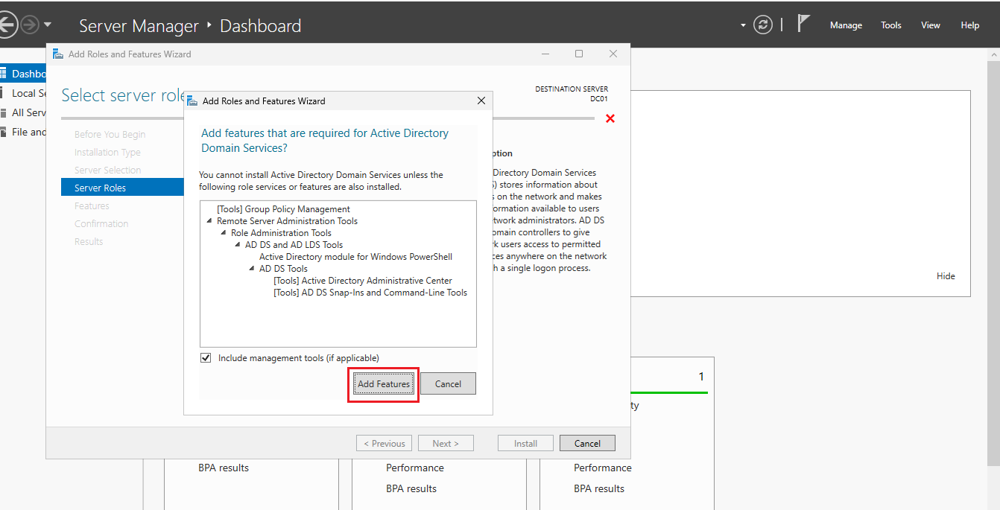
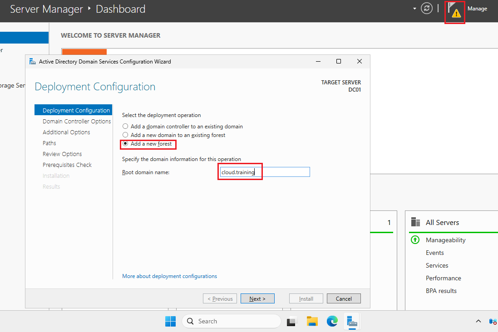
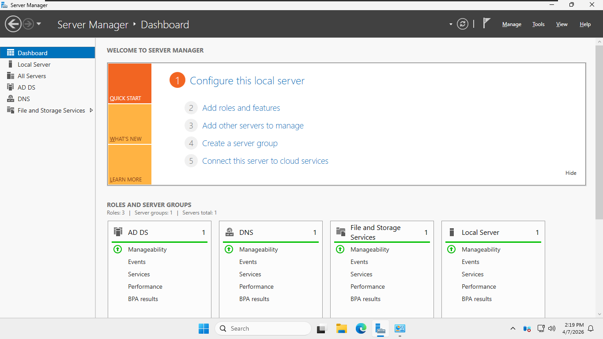
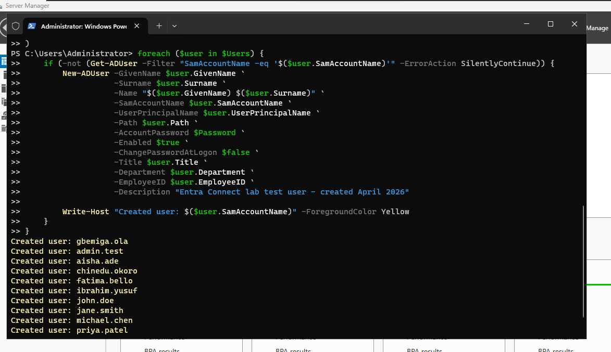
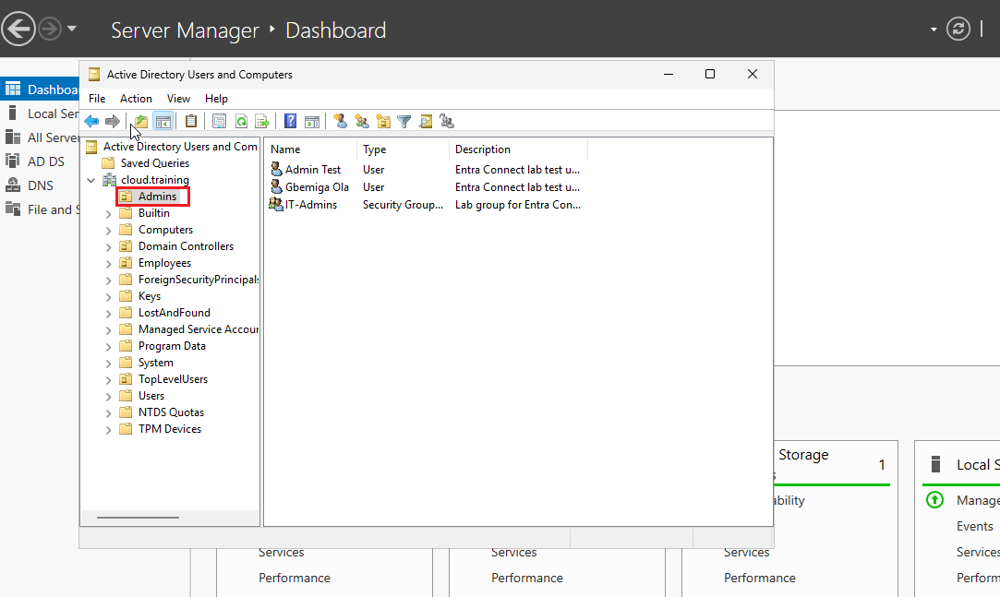
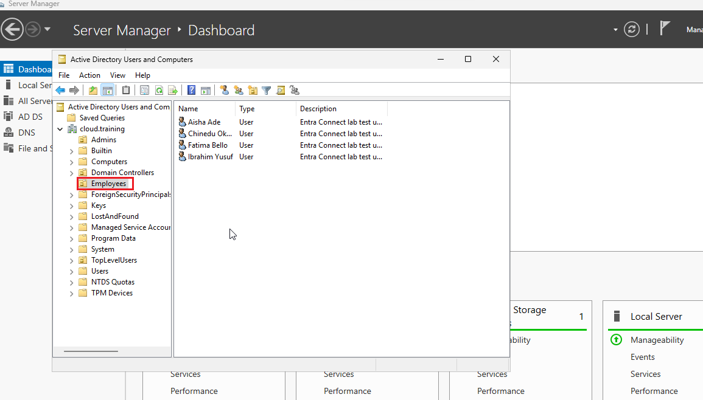

**What I Did**  

**1. Built the VMware Lab Environment**  
I created a new VM in VMware Workstation, installed Windows Server 2022, and configured it as a domain controller.  
- Assigned static IP: `192.168.10.10/24`  
- Installed Active Directory Domain Services role via Server Manager  
- Promoted the server to a domain controller for `cloud.training`  
- Created Organizational Units: `Admins`, `Employees`, and a top-level `Users` OU  
- Added 12 test users and 3 security groups (e.g., “Finance-Team”, “IT-Admins”) using both GUI and a quick PowerShell script for bulk creation

| Installing the Active Directory Domain Services role via Server Manager | Promoting the Active Directory Domain Services role via Server Manager | DC01 powered on and healthy  |
|------|--------|--------|
|   |   |  |
| Installing the Active Directory Domain Services role via Server Manager | Promoting the Active Directory Domain Services role via Server Manager | DC01 powered on and healthy |
|   |  | |


*(Screenshot: VMware Workstation VM summary showing DC01 powered on and healthy – img/vmware-lab-overview.png)*  
*(Screenshot: Active Directory Users and Computers showing OU structure and test users – img/ad-ou-structure.png)*  

**2. Installed Microsoft Entra Connect on the Domain Controller**  
I downloaded the latest Entra Connect MSI from the Microsoft Download Center and ran it on DC01.  
- Chose **Customize** (not Express Settings) to have full control  
- Used SQL Express (default for lab)  
- Let the wizard create the service account automatically  
- Installed all prerequisites (Visual C++ redistributable, etc.) without issues  

*(Screenshot: Entra Connect installation wizard on the Customize screen – img/entra-connect-install.png)*  

**3. Ran the Configuration Wizard – Core Setup**  
This was the heart of the project. I walked through every screen carefully:  
- Signed in with my Global Administrator account from the Entra ID tenant  
- Selected **Password Hash Synchronization** + enabled **Seamless Single Sign-On**  
- The wizard automatically detected my `cloud.training` forest  
- Scoped synchronization to the `Users` OU only (for testing)  
- Set source anchor to `msDS-ConsistencyGuid` (best practice)  
- Enabled optional features: directory extension attribute sync (I included `employeeID`, `division`, and `accountExpires`) and password writeback  
- Provided domain admin credentials for SSO configuration  

After the wizard finished, the service account `MSOL_xxxx` was created automatically on-premises, and the cloud service account appeared in my Entra ID tenant.  

*(Screenshot: Configuration wizard summary screen before clicking Install – img/config-wizard-summary.png)*  

**4. Performed Initial Synchronization and Verification**  
I opened PowerShell as admin and forced the first full sync:  
```powershell
Start-ADSyncSyncCycle -PolicyType Initial
```  
Then I monitored progress in the Synchronization Service Manager (miisclient.exe).  

Switched to the Microsoft Entra admin center → Identity → Hybrid management → Microsoft Entra Connect:  
- Sync status showed “Healthy”  
- All 12 users and groups appeared with “On-premises Sync Enabled: Yes”  
- Confirmed Password Hash Sync and Seamless SSO were active for the domain  

*(Screenshot: Entra admin center showing synchronized users and sync status – img/entra-sync-verification.png)*  

**5. Advanced Configuration & Management (Post-Installation)**  
I re-ran the wizard to expand the sync scope from the `Users` OU to the entire domain (important lesson: OU changes require wizard re-run).  

Then I dove into PowerShell management for production-like control:  
- Checked and adjusted the deletion threshold (default was too high for my small lab):  
  ```powershell
  Get-ADSyncExportDeletionThreshold
  Enable-ADSyncExportDeletionThreshold -DeletionThreshold 50
  ```  
- Customized the sync schedule from the default 30 minutes to 2 hours:  
  ```powershell
  Get-ADSyncScheduler
  Set-ADSyncScheduler -CustomizedSyncCycleInterval 02:00:00
  ```  
- Practiced suspending/resuming sync:  
  ```powershell
  Stop-ADSyncSyncCycle
  Start-ADSyncSyncCycle -PolicyType Delta
  ```  

I also simulated a common issue by creating a user with a space in the UPN (“Feliciano D Rosa”), which caused a data validation error during export. Fixed it by editing the UPN in AD, then forced a delta sync—everything resolved cleanly.  

*(Screenshot: PowerShell output showing custom deletion threshold and sync scheduler – img/powershell-advanced.png)*  
*(Screenshot: Synchronization Service Manager showing successful export after UPN fix – img/sync-manager-errors-fixed.png)*  

**6. Final Testing & Cleanup**  
- Changed a user’s phone number and division attribute on-premises → confirmed it synced to Entra ID within the new 2-hour interval  
- Verified Seamless SSO worked by signing into the Microsoft 365 portal from a test client VM  
- Took snapshots in VMware before and after major changes (lifesaver for labs!)  

**Key Takeaways**  
This project gave me real confidence in hybrid identity management. I now fully understand:  
- How Entra Connect actually works under the hood (connector space → metaverse → export)  
- Why scoping OUs properly matters in the beginning  
- The importance of PowerShell for ongoing management (deletion threshold, custom schedules, forced syncs)  
- Common pitfalls like UPN formatting and how quickly they can be fixed  
- The value of keeping changes mastered on-premises while enjoying cloud benefits  

I feel comfortable recommending and implementing this exact setup for small-to-medium organizations transitioning to Microsoft 365. The entire lab took me about 4 hours from VM creation to final verification—fast, repeatable, and zero cloud compute cost thanks to VMware Workstation.

**Repository Contents**  
- `README.md` – This file  
- `img/` – All screenshots and diagrams I captured during the build  
- `scripts/` – PowerShell scripts I wrote for bulk user creation and sync management (included for reference)  

Feel free to clone, adapt, or use this as a starting point for your own hybrid identity labs. I learned a ton and had fun doing it!  

— Gbemiga  
*Last updated: April 2026*
