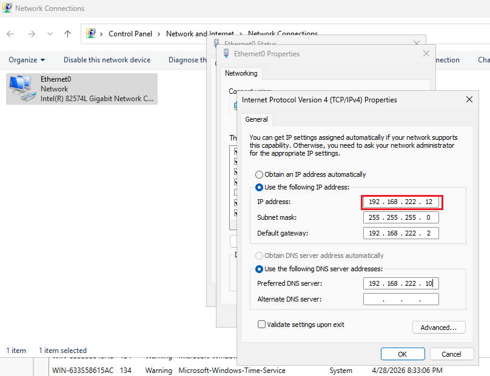
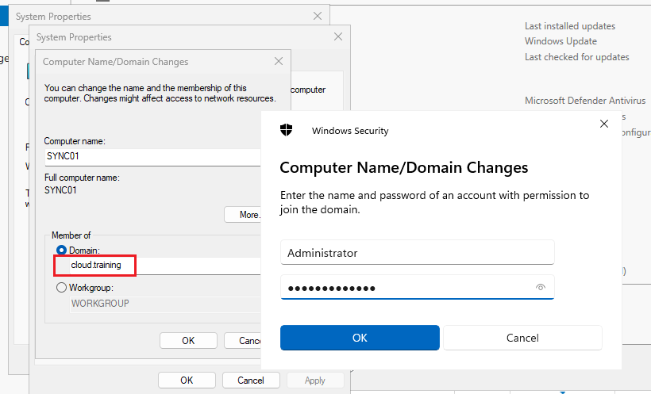
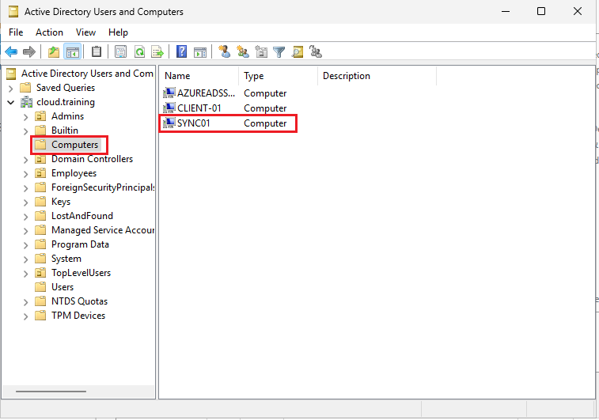
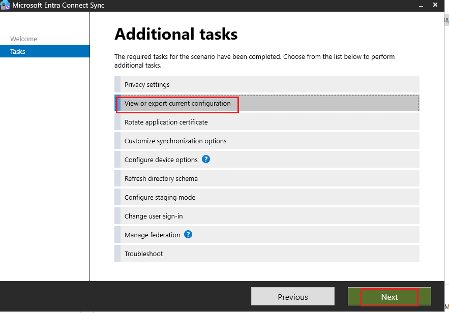
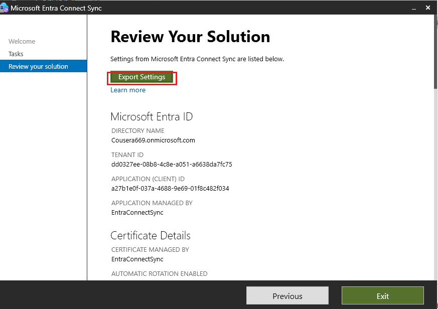
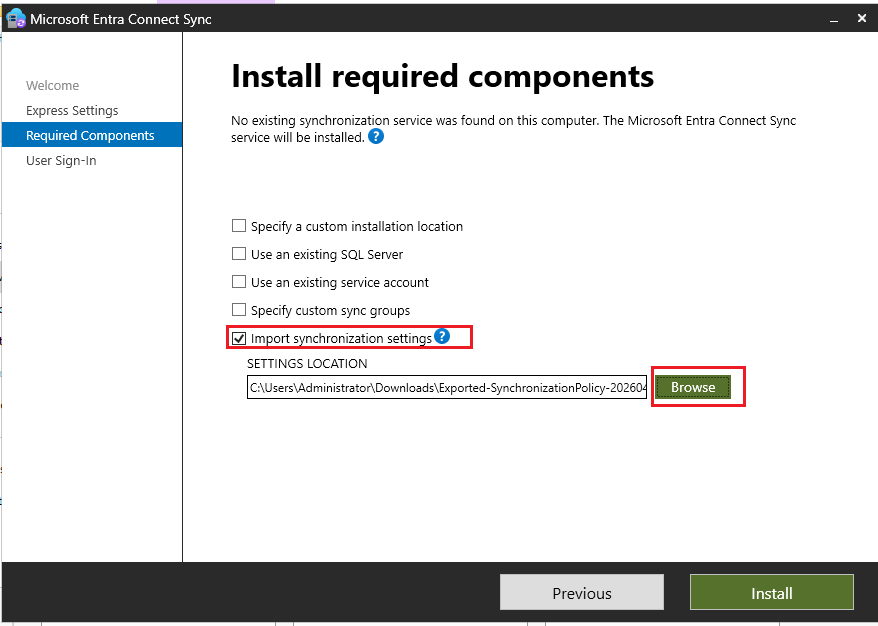
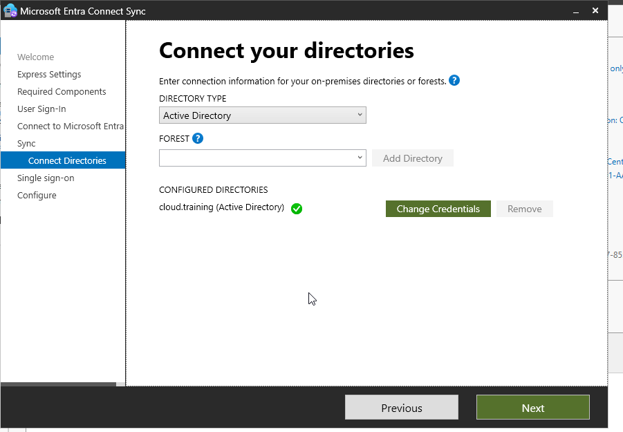
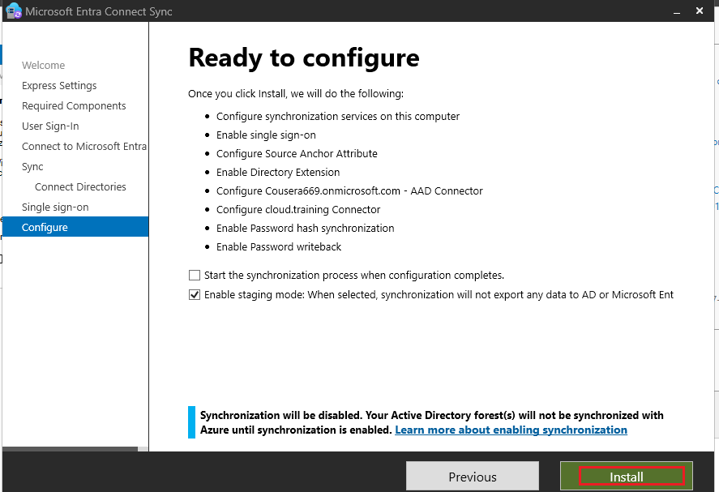
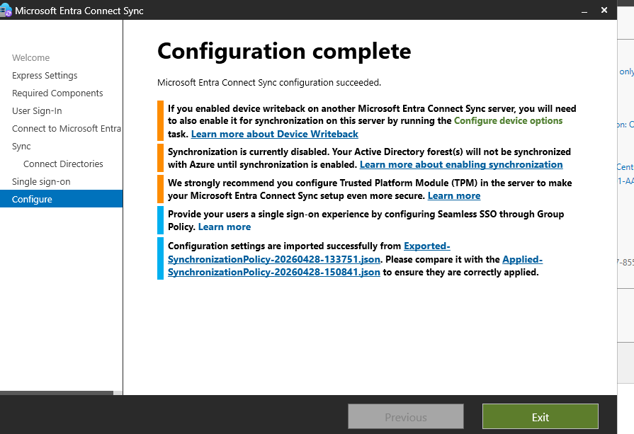

**What I Did – Step by Step**

**1. Created the New Server (SYNC01) in VMware Workstation**  
I created a new VM in VMware Workstation Pro:  
- OS: Windows Server 2022 (or 2025 if available – officially supported). Full Desktop Experience (GUI required).  
- Joined it to the `cloud.training` domain using my domain admin credentials.  
- Assigned static IP (e.g., 192.168.10.20).  
- Installed the latest Windows updates.  
- Enabled Remote Desktop for easy management.
- 
| Setting a static IPV4 | Domain Joined | Verified the Server in DC01 |
|------|--------|--------|
|   |   |  |


**2. Prepared the Current Server (DC01)**  
On **DC01** (current active Entra Connect server):  
- Opened **Microsoft Entra Connect** from the Start menu.  
- Clicked **Configure** → **View or export current configuration**.  
- Exported the full configuration settings to a JSON file (saved to a network share accessible from SYNC01).  
- (Optional but recommended) Updated Entra Connect to the latest version first.

| Selected the View Configuraton | Exported the Configuration from DC01 | 
|------|--------|
|   | 

**3. Installed Entra Connect on SYNC01 in Staging Mode**  
On the new **SYNC01** server:  
- Downloaded the latest Microsoft Entra Connect installer from the Microsoft Entra admin center.  
- Ran the installer as Administrator.  
- Chose **Customize** installation.  
- Signed in with my **Hybrid Identity Administrator** (or Global Admin) account from the Entra tenant.  
- Imported the configuration JSON file exported from DC01 (this brings over all my OU scoping, attribute rules, Password Hash Sync, Seamless SSO, etc.).  
- On the final page of the wizard:  
  - Checked **Enable staging mode**.  
  - **Unchecked** “Start the synchronization process when configuration completes.”  
- Completed the installation.

The new server now runs full imports and synchronizations internally but does **not** export any changes to Entra ID or on-premises AD (perfect for safe testing).


| Imported the Configuration to SYNC01 | Signed in with my domain account | 
|------|--------|
|   | 
| <p align="center"> **Enabled Staging Mode** </p> | <p align="center"> **Installation summary** </p> | 
|   | 


**4. Verified the Staging Server**  
On **SYNC01**:  
- Opened **Synchronization Service Manager** (`miisclient.exe`).  
- Performed manual **Full Import** and **Full Synchronization** on the AD connector, then on the Microsoft Entra ID connector.  
- Used the export preview feature (or CSExportAnalyzer) to verify that expected changes matched what the old server would do.  
- Ran my verification scripts to confirm users, groups, and attributes looked correct in the metaverse.

**5. Switched Over (Promote SYNC01 to Active)**  
Once I was happy with the staging results:  

**On DC01 (old server):**  
- Opened Entra Connect wizard → **Configure staging mode**.  
- Signed in with Hybrid Identity Administrator.  
- Enabled **Staging Mode** (this stops exports from DC01).  

**On SYNC01 (new server):**  
- Opened Entra Connect wizard → **Configure staging mode**.  
- Signed in.  
- **Unchecked** Staging Mode.  
- Chose to start synchronization immediately.  
- Clicked **Configure**.

SYNC01 is now the active server. Synchronization resumed with minimal (or zero) downtime.

**6. Post-Migration Cleanup & Verification**  
- In the Microsoft Entra admin center → **Identity** → **Hybrid management** → **Microsoft Entra Connect**, confirmed SYNC01 shows as the healthy sync server.  
- Forced a delta sync on SYNC01:  
  ```powershell
  Import-Module ADSync
  Start-ADSyncSyncCycle -PolicyType Delta
  ```
- Re-ran `dsregcmd /status` on Client-01 and verified Seamless SSO still worked for users like `michael.chen`.  
- Monitored the Synchronization Service for any errors.  
- Took snapshots of both VMs.  
- (Later) I can decommission or repurpose DC01’s Entra Connect installation.

**Key Takeaways from This Migration**  
- Zero-downtime move thanks to staging mode.  
- Cleaner, more secure architecture with Entra Connect on a dedicated member server.  
- Ready for future configuration testing (e.g., new attribute flows or filtering) without risking production sync.  
- The process reinforced why dedicated servers are best practice — I can now patch/reboot SYNC01 independently without touching my domain controller.

**Repository Updates for Part 2**  
- Added folder `Part2-Migration/` with:  
  - Screenshots of SYNC01 creation, export/import process, staging mode switches.  
  - Updated `scripts/` with `export-config.ps1` and `verify-staging.ps1`.  
  - This README section.

The hybrid identity lab is now more production-like. My 12 test users, groups, Password Hash Sync, Seamless SSO, and Hybrid Join continue to work seamlessly from the new dedicated server.

I learned a ton about safe migration paths and why Microsoft recommends keeping Entra Connect off domain controllers.  

Next steps could include setting up a second staging server for true high availability or exploring advanced filtering — but for now, the move is complete and stable.

— Gbemiga  
*May 2026*
